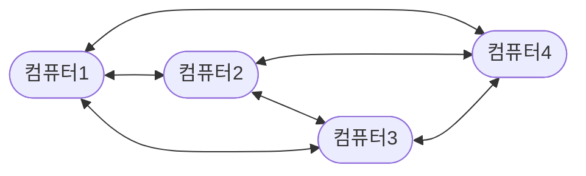
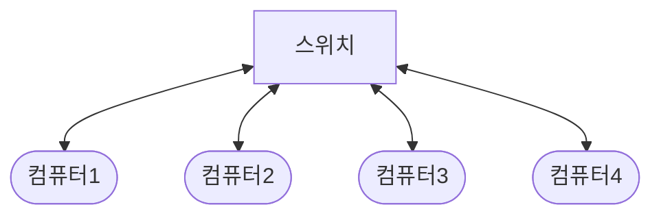
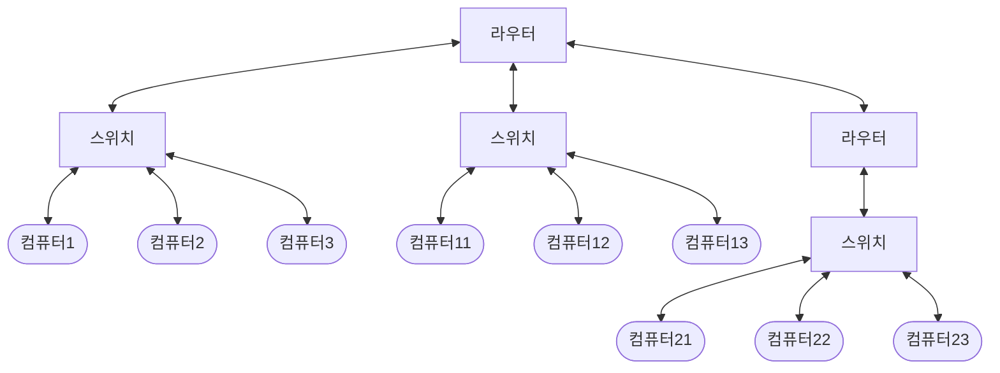
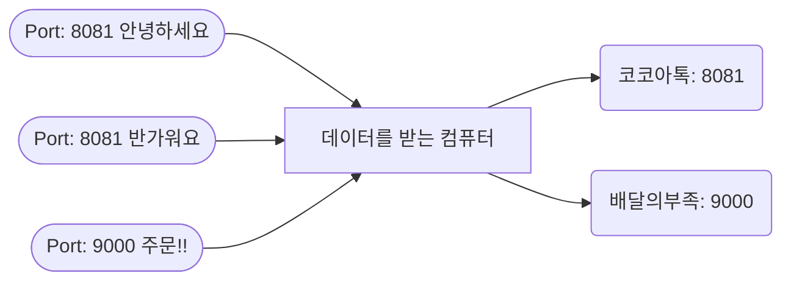

# TCP/IP 5계층

### 계층

 계층별로 **역할을 분리**해서 각 계층이 **독립적**으로 기능을 수행하고, 계층 간 **통신**을 통해 전체 통신 프로세스를 가능하게 한다.

 이를 통해 네트워크 통신 과정을 **단계별로** 파악할 수 있으며, 문제가 발생했을 때도 문제 계층을 빠르게 파악할 수 있다. 또한 네트워크 통신에 필요한 HW와 SW를 **표준화**함으로써, 서비스나 기기 간 **호환**을 가능하게 한다

기존 전통적인 네트워킹 모델은 물리, 데이터링크, 네트워크, 전송, 세션, 표현, 응용으로 나뉘어진 OSI 7계층으로 분류 되었으나, 인터넷의 발달로 인해 요즘은 TCP/IP 4계층이 떠오르고 있다.

- `Application` + `Presentation` + `Session` → `Application`
- `Network` → `Internet`
- `Data Link` + `Physical` → `Link`

이후 꾸준히 표준이 갱신되면서 하위 레이어를 다시 세분화하여 5계층으로 분류한 TCP/IP Updated 모델이 탄생했다.

| Layer Number | Layer Name | Addressing | Protocol Data Unit | Protocol |
| --- | --- | --- | --- | --- |
| L5 | Application | - | Message | HTTP, SSH, FTP, SMTP, POP |
| L4 | Transport | Port Number | Segment, Datagram | TCP, UDP |
| L3 | Network | IP Address | Packet | IP |
| L2 | Data-Link | MAC Address | Frame | IEEE 802, Ethernet, Wi-Fi |
| L1 | Physical | - | Bit, Signal | - |

## L1. 물리 계층

1:1 통신을 생각해보자.

# 💻 —————— 💻

### 010101…〰️〰️〰️〰️〰️…010101

- 0과 1의 나열을 아날로그 신호로 바꾸어 전선으로 보냄 (encoding)
- 아날로그 신호가 들어오면 0과 1의 나열로 해석 (decoding)
- 물리적으로 연결된 두 대의 컴퓨터가 위의 과정을 통해 0과 1의 나열을 주고받을 수 있게 해주는 모듈
- 하드웨어적으로 구현되어 있음.

## L2. 데이터링크 계층

이제는 여러 대와 통신을 하고 싶어졌다.

물리적으로 모든 컴퓨터를 연결하는 것은 비용 측면에서 비효율적이다.

- 데이터링크 계층은 같은 네트워크에 있는 여러 대의 컴퓨터들이 데이터를 주고받기 위해 필요한 모듈
- Framing 과정을 통해서 데이터가 제대로 읽히도록 시작과 끝을 규격화해준다.
- 스위치는 한 네트워크 안에서 전송한 데이터의 목적지(MAC Address)를 확인해서 원하는 목적지로만 전달하게 해준다.

## L3. 네트워크 계층

이제는 하나의 네트워크뿐만 아니라 다른 네트워크와 통신을 하고 싶다

- 수많은 네트워크들의 연결로 이루어지는 인터넷 속에서 목적지 컴퓨터로 데이터를 전송하기 위해서
- IP주소를 이용해서 길을 찾고 (routing)
- 자신 다음의 라우터에게 데이터를 넘겨주는 것(forwarding)
- 운영체제의 커널에 소프트웨어적으로 구현되어 있음.

## L4. 전송 계층

전송받은 데이터를 알맞은 프로세스에게 주고 싶다.

- Port 번호를 사용하여 도착지 컴퓨터의 최종 도착지인 프로세스까지 데이터가 도달하게 하는 모듈
- 운영체제의 커널에 소프트웨어적으로 구현되어 있음.

## L5. 응용 계층

- 프로그램 구현체와 사용자 인터페이스를 의미한다.
- HTTP, FTP, SSH, SMTP, POP 등 다양한 프로토콜이 활용된다.

## 예상 질문

- 스위치와 라우터는 차이는 무엇인가?
    
    스위치와 라우터 둘 다 데이터를 데이터의 목적지로 가는 적합한 경로를 찾아주는 역할을 합니다. 하지만 스위치는 데이터링크 계층에 속하여 MAC주소를 기반으로 동작하고, 라우터는 네트워크 계층에 속하여 IP주소를 기반으로 동작한다는 차이점이 있습니다. 
    

## 참고자료

- [우아한 테코톡](https://youtu.be/1pfTxp25MA8)
- [OSI 7계층 & TCP/IP 5계층](https://velog.io/@jwkim/cs-nw-osi-tcp-ip)
